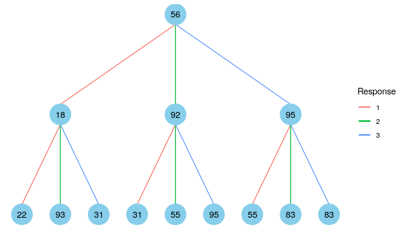
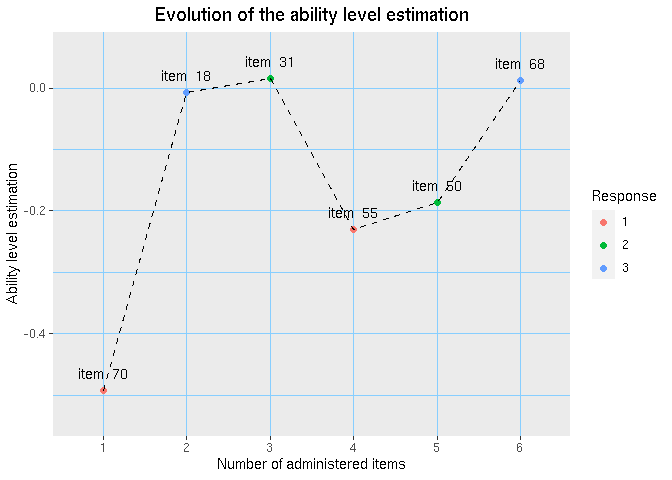

<!-- README.md is generated from README.Rmd. Please edit that file -->

[](https://cran.r-project.org/package=cat.dt)
[](https://cran.r-project.org/package=cat.dt)
[](https://cran.r-project.org/package=cat.dt)
[](https://cran.r-project.org/package=cat.dt)
[](https://doi.org/10.1016/j.eswa.2019.113066)

The cat.dt package implements the Merged Tree-CAT method
(Rodríguez-Cuadrado et al., 2019,
[doi.org/10.1016/j.eswa.2019.113066](https://doi.org/10.1016/j.eswa.2019.113066))
aimed at creating Computerized Adaptive Tests (CATs) in a fast and
efficient way. The package stores the CAT in a tree structure where each
node contains an item of the test. The examinee starts from a root node
and progresses through the tree, depending on the responses provided to
the items found.

The cat.dt package includes the following functionalities:

  - Building of the Tree-CAT.
  - Graphical display of the Tree-CAT created.
  - Estimation of the ability level for an individual or group of
    examinees.
  - Graphical visualization of the evolution of the estimation of the
    ability level of each examinee according to their responses.

## Tree-CAT creation

The package can be installed from CRAN:

``` r
install.packages("cat.dt")
```

``` r
library(cat.dt)
```

It can also be installed from the development version’s github
repository [github.com/jlaria/cat.dt](https://github.com/jlaria/cat.dt).

Once the package is installed, the Tree-CAT is built by calling the main
function `CAT_DT`. This function has the following input parameters:

  - `bank`: Item bank. It must be a data frame in which each row
    represents an item and each column one of its parameters. If the
    probabilistic response model chosen is the Graded Response Model
    (GRM, polytomous items with ordered responses) (Samejima, 1969,
    [doi.org/10.1007/BF03372160](https://doi.org/10.1007/BF03372160)),
    the first column must be the discrimination parameter and the
    remaining columns the difficulty (or location) parameters. If the
    model is the Nominal Response Model (NRM, polytomous items without
    ordered responses) (Bock, 1972,
    [doi.org/10.1007/BF02291411](https://doi.org/10.1007/BF02291411)),
    the odd columns must be the slope parameters and the even columns
    the intercept parameters.
  - `model`: CAT probabilistic model. Options: `"GRM"` (default) and
    `"NRM"`.
  - `crit`: Item selection criterion. Options: `"MEPV"` for the Minimum
    Expected Posterior Variance (default) or `"MFI"` for the Maximum
    Fisher Information.
  - `C`: Expected fraction \(C\) of participants administered with each
    item (exposure rate). It can be a vector with as many elements as
    items in the bank or a positive number if all the items have the
    same rate. Default: `C = 0.3`.
  - `stop`: Number \(L\) of levels of the tree that indicate the number
    of items that are administered to each examinee (test length). It
    must be a natural number. Default: `stop = 6`.
  - `limit`: Maximum number \(N\) of nodes per level (max. \(N=10000\)).
    This is the main parameter that controls the tree growth. It must be
    a natural number. Default: `limit = 200`.
  - `inters`: Minimum intersection of the density functions of two nodes
    to be joined. It must be a number between 0 and 1. If the user wants
    to avoid using this criterion, `inters = 0` should be specified.
    Default: `inters = 0.98`.
  - `p`: Prior probability of the interval whose limits determine a
    threshold for the distance between estimations of nodes to join.
    Default: `p = 0.9`.
  - `dens`: Prior density function of the latent level. It must be an R
    function: `dnorm`, `dunif`, etc.
  - `...`: Parameters to `dens`.

Therefore, it is necessary to have a bank of calibrated items in the
form of ‘data.frame’ or ‘matrix’. The cat.dt package includes an item
bank that will be used in this tutorial:

``` r
data("itemBank")
```

The function `CAT_DT` is called and the tree is stored in the variable
`TreeCAT`:

``` r
TreeCAT = CAT_DT(bank = itemBank, model = "GRM", crit = "MEPV", C = 0.3, stop = 6, limit = 200, inters = 0.98, p = 0.9, dens = dnorm, 0, 1)
```

The function `CAT_DT` returns an object of class `cat.dt`. This object
contains a list of the input parameters and also the following elements:

  - `nodes`: List with \(L+1\) elements (levels). Each level contains a
    list of the nodes of the corresponding level. The nodes of the
    additional level \(L+1\) only include the estimation and
    distribution of the ability level, given the responses to the items
    of the final level \(L\).

  - `C_left`: Residual exposure rate of each item after the CAT
    construction.

  - `predict`: Function that returns the estimated ability level of an
    examinee after each response and a Bayesian credible interval of the
    final estimation given their responses to the items from the item
    bank. These responses must be entered by the user as a numeric
    vector input. In addition, it returns a vector with the items that
    have been administered to the examinee and a plot object named
    `graphics` that represents the evolution of the ability level
    estimation through the test.

  - `predict_group`: Function that returns a list whose elements are the
    returned values of the function `predict` for every examinee.

## Tree-CAT summary

The Tree-CAT summary is a description of the Tree-CAT that contains the
following elements:

  - The number of the Tree-CAT levels.
  - The number of nodes in each Tree-CAT level.
  - The psychometric probabilistic model used.
  - The item selection criterion used.
  - The exposure of every item from the bank after the Tree-CAT
    creation.
  - The percentage of items used in the Tree-CAT creation.

The summary is obtained in the following way:

``` r
summary(TreeCAT)
#> ----------------------------------------------------------------------
#> Number of tree levels: 6 
#> 
#> Number of nodes in level 1 : 4 
#> Number of nodes in level 2 : 14 
#> Number of nodes in level 3 : 39 
#> Number of nodes in level 4 : 99 
#> Number of nodes in level 5 : 101 
#> Number of nodes in level 6 : 124 
#> ----------------------------------------------------------------------
#> Psychometric probabilistic model: GRM 
#> Item selection criterion: MEPV 
#> ----------------------------------------------------------------------
#> Item exposure:
#> item  1 : 0.000   item  2 : 0.000   item  3 : 0.000   item  4 : 0.1704   
#> item  5 : 0.0469   item  6 : 0.000   item  7 : 0.0874   item  8 : 0.000   
#> item  9 : 0.000   item  10 : 0.000   item  11 : 0.300   item  12 : 0.000   
#> item  13 : 0.000   item  14 : 0.000   item  15 : 0.2416   item  16 : 0.000   
#> item  17 : 0.000   item  18 : 0.300   item  19 : 0.000   item  20 : 0.000   
#> item  21 : 0.0479   item  22 : 0.2565   item  23 : 0.000   item  24 : 0.000   
#> item  25 : 0.0312   item  26 : 0.000   item  27 : 0.000   item  28 : 0.000   
#> item  29 : 0.000   item  30 : 0.000   item  31 : 0.300   item  32 : 0.000   
#> item  33 : 0.0058   item  34 : 0.000   item  35 : 0.000   item  36 : 0.000   
#> item  37 : 0.000   item  38 : 0.000   item  39 : 0.2467   item  40 : 0.000   
#> item  41 : 0.000   item  42 : 0.000   item  43 : 0.0043   item  44 : 0.233   
#> item  45 : 0.000   item  46 : 0.000   item  47 : 0.000   item  48 : 0.000   
#> item  49 : 0.000   item  50 : 0.300   item  51 : 0.1022   item  52 : 0.000   
#> item  53 : 0.000   item  54 : 0.000   item  55 : 0.300   item  56 : 0.300   
#> item  57 : 0.000   item  58 : 0.000   item  59 : 0.2066   item  60 : 0.000   
#> item  61 : 0.300   item  62 : 0.000   item  63 : 0.0124   item  64 : 0.000   
#> item  65 : 0.000   item  66 : 0.0367   item  67 : 0.000   item  68 : 0.300   
#> item  69 : 0.000   item  70 : 0.300   item  71 : 0.000   item  72 : 0.000   
#> item  73 : 0.0111   item  74 : 0.000   item  75 : 0.000   item  76 : 0.000   
#> item  77 : 0.000   item  78 : 0.000   item  79 : 0.000   item  80 : 0.000   
#> item  81 : 0.000   item  82 : 0.000   item  83 : 0.300   item  84 : 0.000   
#> item  85 : 0.000   item  86 : 0.000   item  87 : 0.1062   item  88 : 0.000   
#> item  89 : 0.000   item  90 : 0.000   item  91 : 0.000   item  92 : 0.300   
#> item  93 : 0.2529   item  94 : 0.300   item  95 : 0.300   item  96 : 0.000   
#> item  97 : 0.000   item  98 : 0.000   item  99 : 0.000   item  100 : 0.000   
#> 
#> Percentage of items used: 31 %
#> ----------------------------------------------------------------------
```

## Tree-CAT visualization

The Tree-CAT is displayed by calling the `plot_tree` function. This
function takes as input arguments: i) The Tree-CAT created; ii) The
number of levels to plot and iii) The index of the root node to start
the test. For example, to visualize the first three levels of the tree
starting by the root node two:

``` r
plot_tree(TreeCAT, levels = 3, tree = 2)
```

 The
number within each node represents the item selected for that node and
the color of each branch represents the response provided. In the figure
above, we can see that the test starts with item 11. If we give answer 1
to that item, we will advance to item 18, and so on.

## Evaluation of an individual and a group of examinees

Once the Tree-CAT is created, it can be administered to an individual or
a group of participants. To administer the Tree-CAT to an individual,
the function `predict` is used. The arguments of this function are the
object `Tree-CAT` of the class `cat.dt` and a vector that contains the
responses provided by the individual to each item from the item bank. It
is important to note that the responses must take integer values from
\(1\) upwards.

As an example, the response dataset `itemRes` included in the package
will be used. From that dataset, the first individual is evaluated
(first row). The output is stored in the variable `individual_ev`:

``` r
individual_ev = predict(TreeCAT, itemRes[1, ])
```

This function returns a list with the following elements:

  - `estimation`: Ability level estimation after each response provided
    by the individual.

  - `llow`: Lower limit of the \(95\%\) credible interval of the final
    estimation.

  - `llup`: Upper limit of the \(95\%\) credible interval of the final
    estimation.

  - `items`: Items administered to the individual.

  - `graphics`: Plot object that represents the evolution of the ability
    level estimation after every response.

The estimation output:

``` r
individual_ev$estimation
#> [1] -0.491765473 -0.006725585  0.014951695 -0.229596747 -0.185539957
#> [6]  0.011995639
```

The credible interval output:

``` r
individual_ev$llow
#> [1] -1.08
individual_ev$lupp
#> [1] 1.11
```

The administered items output:

``` r
individual_ev$items
#> [1] 70 18 31 55 50 68
```

The plot of the evolution of the ability level estimation:

``` r
individual_ev$graphics
```



This plot represents the estimation of the ability level after
responding to each one of the test items. For example, giving the
response \(1\) to the item \(70\) results in an estimate of \(-0.5\).
Then, after giving the response \(3\) to the item \(18\), the estimate
increases to \(0\) approximately, and so on. Note that the value of the
response influences whether the estimate decreases or increases.

This results can also be obtained by introducing

``` r
individual_ev = TreeCAT$predict(itemRes[1, ])
```

or

``` r
individual_ev = CAT_ability_est(TreeCAT, itemRes[1, ])
```

Note: By repeating this same code, the results of this section may be
different. If the tree has a number of root nodes greater than one, the
same individual may start the test by a different root node and
therefore obtain different results when performing the test again.

The function `predict` is also used to evaluate a group of examinees.
However, in this case, the vector of responses is replaced by a matrix
containing in each row the answers of each examinee. This function
returns a list, where each element in the list represents one of the
examinees in the group. Each element contains a list with the same
elements that the function returns when it is applied to an individual.
As an example, we proceed to store the result in the variable
`group_ev`:

``` r
group_ev = predict(TreeCAT, itemRes)
```

If, for example, we want to know which items have been administered to
examinee number 6:

``` r
group_ev[[6]]$items
#> [1] 70 83 95 55 44  7
```
